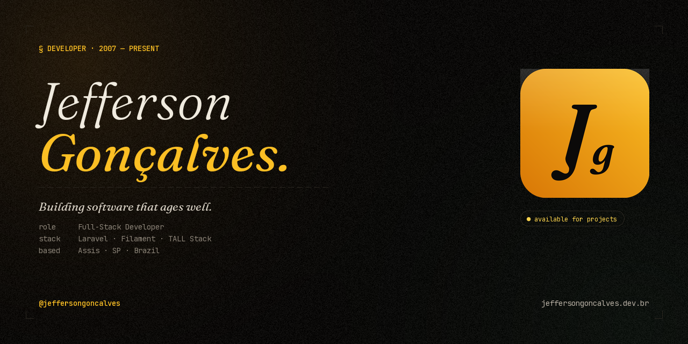

<!-- BANNER -->

 

<!-- HEADER -->

 

# Hey, I'm Jefferson Gonçalves 👋

**Building the Laravel ecosystem, one package at a time.**

---

## 🧑‍💻 About Me

I'm a **Full Stack PHP Developer** from **Assis, SP, Brazil** with over **18 years** of hands-on experience building robust platforms, managing server infrastructures, and crafting scalable solutions for businesses of all sizes.

My passion lives in the **open source** world — I actively maintain **20+ Filament plugins** and a growing collection of **Laravel packages** used by thousands of developers worldwide. I believe great software should be accessible to everyone.

- 🔭 Currently focused on the **TALL Stack** (Tailwind, Alpine.js, Livewire, Laravel)
- 🛠️ Creator of the **Filakit** ecosystem — starter kits for Filament v3, v4 & v5
- 🌍 Active contributor to the **Filament** and **Laravel** communities
- 💬 Ask me about **Filament, Laravel, Livewire, API integrations**
- ⚡ Fun fact: I've published **80+ repositories** and still counting

---

## 🛠️ Tech Stack

---

## 📊 GitHub Stats

  
  

  

  

---

## 🚀 Filakit — Open Source Starter Kits for Laravel

A complete ecosystem of ready-to-use starter kits built on **Filament + Laravel**, available for versions **v3, v4 & v5**.

| Project | Latest Version | Downloads | Stars |
|:--------|:-------------:|:---------:|:-----:|
| [**Base Kit v5**](https://github.com/filakitphp/basev5) Contribution |  |  |  |
| [**ERP Kit v5**](https://github.com/jeffersongoncalves/erpkitv5) |  |  |  |
| [**Evolution Kit v5**](https://github.com/jeffersongoncalves/evolutionkitv5) |  |  |  |
| [**FilaFlux Kit v5**](https://github.com/jeffersongoncalves/filafluxkitv5) |  |  |  |
| [**Fila Kit v5**](https://github.com/jeffersongoncalves/filakitv5) |  |  |  |
| [**Help Desk Kit v5**](https://github.com/jeffersongoncalves/helpdeskkitv5) |  |  |  |
| [**MFA Kit v5**](https://github.com/jeffersongoncalves/mfakitv5) |  |  |  |
| [**Mobile Kit v5**](https://github.com/jeffersongoncalves/mobilekitv5) |  |  |  |
| [**Native Kit v5**](https://github.com/jeffersongoncalves/nativekitv5) |  |  |  |
| [**Service Desk Kit v5**](https://github.com/jeffersongoncalves/servicedeskkitv5) |  |  |  |
| [**Team Kit v5**](https://github.com/jeffersongoncalves/teamkitv5) |  |  |  |

📦 View previous versions (v3 & v4)

| Project | Latest Version | Downloads | Stars |
|:--------|:-------------:|:---------:|:-----:|
| [**Base Kit v3**](https://github.com/filakitphp/basev3) Contribution |  |  |  |
| [**Base Kit v4**](https://github.com/filakitphp/basev4) Contribution |  |  |  |
| [**ERP Kit v3**](https://github.com/jeffersongoncalves/erpkitv3) |  |  |  |
| [**ERP Kit v4**](https://github.com/jeffersongoncalves/erpkitv4) |  |  |  |
| [**Evolution Kit v4**](https://github.com/jeffersongoncalves/evolutionkitv4) |  |  |  |
| [**Fila Kit v3**](https://github.com/jeffersongoncalves/filakit) |  |  |  |
| [**Fila Kit v4**](https://github.com/jeffersongoncalves/filakitv4) |  |  |  |
| [**Help Desk Kit v3**](https://github.com/jeffersongoncalves/helpdeskkitv3) |  |  |  |
| [**Help Desk Kit v4**](https://github.com/jeffersongoncalves/helpdeskkitv4) |  |  |  |
| [**MFA Kit v4**](https://github.com/jeffersongoncalves/mfakitv4) |  |  |  |
| [**Mobile Kit v3**](https://github.com/jeffersongoncalves/mobilekit) |  |  |  |
| [**Mobile Kit v4**](https://github.com/jeffersongoncalves/mobilekitv4) |  |  |  |
| [**Native Kit v3**](https://github.com/jeffersongoncalves/nativekit) |  |  |  |
| [**Native Kit v4**](https://github.com/jeffersongoncalves/nativekitv4) |  |  |  |
| [**Service Desk Kit v3**](https://github.com/jeffersongoncalves/servicedeskkitv3) |  |  |  |
| [**Service Desk Kit v4**](https://github.com/jeffersongoncalves/servicedeskkitv4) |  |  |  |
| [**Team Kit v3**](https://github.com/jeffersongoncalves/teamkit) |  |  |  |
| [**Team Kit v4**](https://github.com/jeffersongoncalves/teamkitv4) |  |  |  |

---

## 🔌 Filament Plugins

Plugins I created and maintain for the **Filament** ecosystem.

| Plugin | Downloads | Stars | Compatibility |
|:-------|:---------:|:-----:|:-------------:|
| [**Filament Ace Editor Field**](https://github.com/jeffersongoncalves/filament-ace-editor-field) |  |  | v4 · v5 |
| [**Filament Action Export**](https://github.com/jeffersongoncalves/filament-action-export) |  |  | v3 · v4 · v5 |
| [**Filament Additional Information**](https://github.com/jeffersongoncalves/filament-additional-information) |  |  | v3 · v4 · v5 |
| [**Filament Analytics Core**](https://github.com/jeffersongoncalves/filament-analytics-core) |  |  | v3 · v4 · v5 |
| [**Filament Ban**](https://github.com/jeffersongoncalves/filament-ban) |  |  | v3 · v4 · v5 |
| [**Filament CEP Field**](https://github.com/jeffersongoncalves/filament-cep-field) |  |  | v3 · v4 · v5 |
| [**Filament Check Whois Widget**](https://github.com/jeffersongoncalves/filament-check-whois-widget) |  |  | v3 · v4 · v5 |
| [**Filament Cookie Consent**](https://github.com/jeffersongoncalves/filament-cookie-consent) |  |  | v3 · v4 · v5 |
| [**Filament Documentation**](https://github.com/jeffersongoncalves/filament-documentation) |  |  | v3 · v4 · v5 |
| [**Filament ERP**](https://github.com/jeffersongoncalves/filament-erp) |  |  | v3 · v4 · v5 |
| [**Filament ERP Accounting**](https://github.com/jeffersongoncalves/filament-erp-accounting) |  |  | v3 · v4 · v5 |
| [**Filament ERP Assets**](https://github.com/jeffersongoncalves/filament-erp-assets) |  |  | v3 · v4 · v5 |
| [**Filament ERP Buying**](https://github.com/jeffersongoncalves/filament-erp-buying) |  |  | v3 · v4 · v5 |
| [**Filament ERP Core**](https://github.com/jeffersongoncalves/filament-erp-core) |  |  | v3 · v4 · v5 |
| [**Filament ERP CRM**](https://github.com/jeffersongoncalves/filament-erp-crm) |  |  | v3 · v4 · v5 |
| [**Filament ERP Maintenance**](https://github.com/jeffersongoncalves/filament-erp-maintenance) |  |  | v3 · v4 · v5 |
| [**Filament ERP Manufacturing**](https://github.com/jeffersongoncalves/filament-erp-manufacturing) |  |  | v3 · v4 · v5 |
| [**Filament ERP Projects**](https://github.com/jeffersongoncalves/filament-erp-projects) |  |  | v3 · v4 · v5 |
| [**Filament ERP Quality**](https://github.com/jeffersongoncalves/filament-erp-quality) |  |  | v3 · v4 · v5 |
| [**Filament ERP Selling**](https://github.com/jeffersongoncalves/filament-erp-selling) |  |  | v3 · v4 · v5 |
| [**Filament ERP Stock**](https://github.com/jeffersongoncalves/filament-erp-stock) |  |  | v3 · v4 · v5 |
| [**Filament ERP Subcontracting**](https://github.com/jeffersongoncalves/filament-erp-subcontracting) |  |  | v3 · v4 · v5 |
| [**Filament ERP Support**](https://github.com/jeffersongoncalves/filament-erp-support) |  |  | v3 · v4 · v5 |
| [**Filament Fathom**](https://github.com/jeffersongoncalves/filament-fathom) |  |  | v3 · v4 · v5 |
| [**Filament Flux**](https://github.com/jeffersongoncalves/filament-flux) |  |  | v5 |
| [**Filament Flux Pro**](https://github.com/jeffersongoncalves/filament-flux-pro) |  |  | v5 |
| [**Filament Gtag**](https://github.com/jeffersongoncalves/filament-gtag) |  |  | v3 · v4 · v5 |
| [**Filament GTM**](https://github.com/jeffersongoncalves/filament-gtm) |  |  | v3 · v4 · v5 |
| [**Filament Help Desk**](https://github.com/jeffersongoncalves/filament-help-desk) |  |  | v3 · v4 · v5 |
| [**Filament Hidden Action**](https://github.com/jeffersongoncalves/filament-hidden-action) |  |  | v4 · v5 |
| [**Filament Keyable**](https://github.com/jeffersongoncalves/filament-keyable) |  |  | v3 · v4 · v5 |
| [**Filament Knowledge Base**](https://github.com/jeffersongoncalves/filament-knowledge-base) |  |  | v3 · v4 · v5 |
| [**Filament Logo**](https://github.com/jeffersongoncalves/filament-logo) |  |  | v3 · v4 · v5 |
| [**Filament Mail**](https://github.com/jeffersongoncalves/filament-mail) |  |  | v3 · v4 · v5 |
| [**Filament Matomo**](https://github.com/jeffersongoncalves/filament-matomo) |  |  | v3 · v4 · v5 |
| [**Filament Metrics Fathom**](https://github.com/jeffersongoncalves/filament-metrics-fathom) |  |  | v3 · v4 · v5 |
| [**Filament Metrics Matomo**](https://github.com/jeffersongoncalves/filament-metrics-matomo) |  |  | v3 · v4 · v5 |
| [**Filament Mixpanel**](https://github.com/jeffersongoncalves/filament-mixpanel) |  |  | v3 · v4 · v5 |
| [**Filament Multi-factor Passkeys**](https://github.com/jeffersongoncalves/filament-multifactor-passkeys) |  |  | v4 · v5 |
| [**Filament Multi-factor WhatsApp**](https://github.com/jeffersongoncalves/filament-multifactor-whatsapp) |  |  | v4 · v5 |
| [**Filament OIDC**](https://github.com/jeffersongoncalves/filament-oidc) |  |  | v5 |
| [**Filament One Time Operations**](https://github.com/jeffersongoncalves/filament-one-time-operations) |  |  | v3 · v4 · v5 |
| [**Filament Panel Theme Isolation**](https://github.com/jeffersongoncalves/filament-panel-theme-isolation) |  |  | v3 · v4 · v5 |
| [**Filament Pixel**](https://github.com/jeffersongoncalves/filament-pixel) |  |  | v3 · v4 · v5 |
| [**Filament Plausible**](https://github.com/jeffersongoncalves/filament-plausible) |  |  | v3 · v4 · v5 |
| [**Filament Plugin Core**](https://github.com/jeffersongoncalves/filament-plugin-core) |  |  | v3 · v4 · v5 |
| [**Filament PWA**](https://github.com/jeffersongoncalves/filament-pwa) |  |  | v3 · v4 · v5 |
| [**Filament QrCode Field**](https://github.com/jeffersongoncalves/filament-qrcode-field) |  |  | v3 · v4 · v5 |
| [**Filament Queue Management**](https://github.com/jeffersongoncalves/filament-queue-management) |  |  | v3 · v4 · v5 |
| [**Filament Refresh Sidebar**](https://github.com/jeffersongoncalves/filament-refresh-sidebar) |  |  | v4 · v5 |
| [**Filament Satis**](https://github.com/jeffersongoncalves/filament-satis) |  |  | v3 · v4 · v5 |
| [**Filament Sensible Defaults**](https://github.com/jeffersongoncalves/filament-sensible-defaults) |  |  | v3 · v4 · v5 |
| [**Filament Service Desk**](https://github.com/jeffersongoncalves/filament-service-desk) |  |  | v3 · v4 · v5 |
| [**Filament Teams**](https://github.com/jeffersongoncalves/filament-teams) |  |  | v3 · v4 · v5 |
| [**Filament Topbar**](https://github.com/jeffersongoncalves/filament-topbar) |  |  | v3 · v4 · v5 |
| [**Filament Translatable**](https://github.com/jeffersongoncalves/filament-translatable) |  |  | v3 · v4 · v5 |
| [**Filament Umami**](https://github.com/jeffersongoncalves/filament-umami) |  |  | v3 · v4 · v5 |
| [**Filament Webhooks**](https://github.com/jeffersongoncalves/filament-webhooks) |  |  | v3 · v4 · v5 |
| [**Filament WhatsApp Widget**](https://github.com/jeffersongoncalves/filament-whatsapp-widget) |  |  | v3 · v4 · v5 |
| [**Filament YAML Editor**](https://github.com/jeffersongoncalves/filament-yaml-editor) |  |  | v3 · v4 · v5 |

### 🤝 Plugins Maintainer

Filament plugins I actively maintain as a **collaborator**.

| Plugin | Downloads | Stars | Compatibility |
|:-------|:---------:|:-----:|:-------------:|
| [**Filament Check SSL Widget**](https://github.com/joaopaulolndev/filament-check-ssl-widget) Contribution |  |  | v3 · v4 · v5 |
| [**Filament Edit Env**](https://github.com/joaopaulolndev/filament-edit-env) Contribution |  |  | v3 · v4 · v5 |
| [**Filament Edit Profile**](https://github.com/joaopaulolndev/filament-edit-profile) Contribution |  |  | v3 · v4 · v5 |
| [**Filament General Settings**](https://github.com/joaopaulolndev/filament-general-settings) Contribution |  |  | v3 · v4 · v5 |
| [**Filament PDF Viewer**](https://github.com/joaopaulolndev/filament-pdf-viewer) Contribution |  |  | v3 · v4 · v5 |
| [**Filament World Clock**](https://github.com/joaopaulolndev/filament-world-clock) Contribution |  |  | v3 · v4 · v5 |

---

## 📦 Laravel Packages

| Package | Latest Version | Downloads | Stars |
|:--------|:-------------:|:---------:|:-----:|
| [**Laravel CEP**](https://github.com/jeffersongoncalves/laravel-cep) |  |  |  |
| [**Laravel Cookie Consent**](https://github.com/jeffersongoncalves/laravel-cookie-consent) |  |  |  |
| [**Laravel Created By**](https://github.com/jeffersongoncalves/laravel-created-by) |  |  |  |
| [**Laravel Discord Logger**](https://github.com/jeffersongoncalves/laravel-discord-logger) |  |  |  |
| [**Laravel ERP Accounting**](https://github.com/jeffersongoncalves/laravel-erp-accounting) |  |  |  |
| [**Laravel ERP Assets**](https://github.com/jeffersongoncalves/laravel-erp-assets) |  |  |  |
| [**Laravel ERP Buying**](https://github.com/jeffersongoncalves/laravel-erp-buying) |  |  |  |
| [**Laravel ERP Core**](https://github.com/jeffersongoncalves/laravel-erp-core) |  |  |  |
| [**Laravel ERP CRM**](https://github.com/jeffersongoncalves/laravel-erp-crm) |  |  |  |
| [**Laravel ERP Maintenance**](https://github.com/jeffersongoncalves/laravel-erp-maintenance) |  |  |  |
| [**Laravel ERP Manufacturing**](https://github.com/jeffersongoncalves/laravel-erp-manufacturing) |  |  |  |
| [**Laravel ERP Projects**](https://github.com/jeffersongoncalves/laravel-erp-projects) |  |  |  |
| [**Laravel ERP Quality**](https://github.com/jeffersongoncalves/laravel-erp-quality) |  |  |  |
| [**Laravel ERP Selling**](https://github.com/jeffersongoncalves/laravel-erp-selling) |  |  |  |
| [**Laravel ERP Stock**](https://github.com/jeffersongoncalves/laravel-erp-stock) |  |  |  |
| [**Laravel ERP Subcontracting**](https://github.com/jeffersongoncalves/laravel-erp-subcontracting) |  |  |  |
| [**Laravel ERP Support**](https://github.com/jeffersongoncalves/laravel-erp-support) |  |  |  |
| [**Laravel Fake Cartoons**](https://github.com/jeffersongoncalves/laravel-fake-cartoons) |  |  |  |
| [**Laravel Fathom**](https://github.com/jeffersongoncalves/laravel-fathom) |  |  |  |
| [**Laravel Favicon Proxy**](https://github.com/jeffersongoncalves/laravel-favicon-proxy) |  |  |  |
| [**Laravel Github Client**](https://github.com/jeffersongoncalves/laravel-github-client) |  |  |  |
| [**Laravel Github Contributions**](https://github.com/jeffersongoncalves/laravel-github-contributions) |  |  |  |
| [**Laravel Github Readme**](https://github.com/jeffersongoncalves/laravel-github-readme) |  |  |  |
| [**Laravel Github Stats**](https://github.com/jeffersongoncalves/laravel-github-stats) |  |  |  |
| [**Laravel Gtag**](https://github.com/jeffersongoncalves/laravel-gtag) |  |  |  |
| [**Laravel Gtm**](https://github.com/jeffersongoncalves/laravel-gtm) |  |  |  |
| [**Laravel Help Desk**](https://github.com/jeffersongoncalves/laravel-help-desk) |  |  |  |
| [**Laravel Html Sanitizer**](https://github.com/jeffersongoncalves/laravel-html-sanitizer) |  |  |  |
| [**Laravel Knowledge Base**](https://github.com/jeffersongoncalves/laravel-knowledge-base) |  |  |  |
| [**Laravel Locale Cookie**](https://github.com/jeffersongoncalves/laravel-locale-cookie) |  |  |  |
| [**Laravel Mail**](https://github.com/jeffersongoncalves/laravel-mail) |  |  |  |
| [**Laravel Markdown**](https://github.com/jeffersongoncalves/laravel-markdown) |  |  |  |
| [**Laravel Matomo**](https://github.com/jeffersongoncalves/laravel-matomo) |  |  |  |
| [**Laravel Metrics Fathom**](https://github.com/jeffersongoncalves/laravel-metrics-fathom) |  |  |  |
| [**Laravel Metrics Matomo**](https://github.com/jeffersongoncalves/laravel-metrics-matomo) |  |  |  |
| [**Laravel Mixpanel**](https://github.com/jeffersongoncalves/laravel-mixpanel) |  |  |  |
| [**Laravel npm Readme**](https://github.com/jeffersongoncalves/laravel-npm-readme) |  |  |  |
| [**Laravel OIDC**](https://github.com/jeffersongoncalves/laravel-oidc) |  |  |  |
| [**Laravel Page Cache**](https://github.com/jeffersongoncalves/laravel-page-cache) |  |  |  |
| [**Laravel Pixel**](https://github.com/jeffersongoncalves/laravel-pixel) |  |  |  |
| [**Laravel Plausible**](https://github.com/jeffersongoncalves/laravel-plausible) |  |  |  |
| [**Laravel Pwa Favicon**](https://github.com/jeffersongoncalves/laravel-pwa-favicon) |  |  |  |
| [**Laravel Pwa Service Worker**](https://github.com/jeffersongoncalves/laravel-pwa-service-worker) |  |  |  |
| [**Laravel Queue Management**](https://github.com/jeffersongoncalves/laravel-queue-management) |  |  |  |
| [**Laravel Satis**](https://github.com/jeffersongoncalves/laravel-satis) |  |  |  |
| [**Laravel Security Headers**](https://github.com/jeffersongoncalves/laravel-security-headers) |  |  |  |
| [**Laravel Service Desk**](https://github.com/jeffersongoncalves/laravel-service-desk) |  |  |  |
| [**Laravel Ssrf Guard**](https://github.com/jeffersongoncalves/laravel-ssrf-guard) |  |  |  |
| [**Laravel Teams**](https://github.com/jeffersongoncalves/laravel-teams) |  |  |  |
| [**Laravel Topic Normalizer**](https://github.com/jeffersongoncalves/laravel-topic-normalizer) |  |  |  |
| [**Laravel Umami**](https://github.com/jeffersongoncalves/laravel-umami) |  |  |  |
| [**Laravel Webhook Signatures**](https://github.com/jeffersongoncalves/laravel-webhook-signatures) |  |  |  |
| [**Laravel Webhooks**](https://github.com/jeffersongoncalves/laravel-webhooks) |  |  |  |
| [**Laravel WhatsApp Widget**](https://github.com/jeffersongoncalves/laravel-whatsapp-widget) |  |  |  |

---

## 🍰 CakePHP Packages

Plugins and components I built for the **CakePHP** framework.

| Package | Latest Version | Downloads | Stars |
|:--------|:-------------:|:---------:|:-----:|
| [**CakePHP Analyzer**](https://github.com/jeffersongoncalves/cakephp-analyzer) |  |  |  |
| [**CakePHP Datatables**](https://github.com/jeffersongoncalves/cakephp-datatables) |  |  |  |
| [**CakePHP Fractal Transformer View**](https://github.com/jeffersongoncalves/cakephp-fractal-transformer-view) |  |  |  |
| [**CakePHP LDAP**](https://github.com/jeffersongoncalves/cakephp-ldap) |  |  |  |
| [**CakePHP Permission**](https://github.com/jeffersongoncalves/cakephp-permission) |  |  |  |
| [**CakePHP REST API**](https://github.com/jeffersongoncalves/cakephp-rest-api) |  |  |  |
| [**CakePHP Settings**](https://github.com/jeffersongoncalves/cakephp-settings) |  |  |  |
| [**CakePHP User Activity**](https://github.com/jeffersongoncalves/cakephp-user-activity) |  |  |  |
| [**CakePHP Utility**](https://github.com/jeffersongoncalves/cakephp-utility) |  |  |  |
| [**CakePHP Utils**](https://github.com/jeffersongoncalves/cakephp-utils) |  |  |  |

---

## ⚡ Laravel Zero Packages

Packages and components I built for the **Laravel Zero** micro-framework.

| Package | Latest Version | Downloads | Stars |
|:--------|:-------------:|:---------:|:-----:|
| [**Laravel Zero Api Client**](https://github.com/jeffersongoncalves/laravel-zero-api-client) |  |  |  |
| [**Laravel Zero Console**](https://github.com/jeffersongoncalves/laravel-zero-console) |  |  |  |
| [**Laravel Zero Credentials**](https://github.com/jeffersongoncalves/laravel-zero-credentials) |  |  |  |
| [**Laravel Zero Git**](https://github.com/jeffersongoncalves/laravel-zero-git) |  |  |  |
| [**Laravel Zero Json Config**](https://github.com/jeffersongoncalves/laravel-zero-json-config) |  |  |  |
| [**Laravel Zero Self Update**](https://github.com/jeffersongoncalves/laravel-zero-self-update) |  |  |  |
| [**Laravel Zero Support**](https://github.com/jeffersongoncalves/laravel-zero-support) |  |  |  |

---

## 🚀 CLI Projects

| Project | Latest Version | Downloads | Stars |
|:--------|:-------------:|:---------:|:-----:|
| [**Banners CLI**](https://github.com/jeffersongoncalves/banners-cli) |  |  |  |
| [**BB CLI**](https://github.com/jeffersongoncalves/bb-cli) |  |  |  |
| [**Filakit CLI**](https://github.com/jeffersongoncalves/filakit-cli) |  |  |  |
| [**Git Worktree CLI**](https://github.com/jeffersongoncalves/git-worktree-cli) |  |  |  |
| [**Jira CLI**](https://github.com/jeffersongoncalves/jira-cli) |  |  |  |
| [**Jq CLI**](https://github.com/jeffersongoncalves/jq-cli) |  |  |  |
| [**Packagist CLI**](https://github.com/jeffersongoncalves/packagist-cli) |  |  |  |
| [**Screentest CLI**](https://github.com/jeffersongoncalves/screentest-cli) |  |  |  |
| [**Secure Lock CLI**](https://github.com/jeffersongoncalves/secure-lock-cli) |  |  |  |

---

## 🧩 JetBrains Plugins

PhpStorm / IntelliJ plugins I built in Kotlin to speed up my own workflow.

| Plugin | Latest Release | Marketplace | Downloads | Stars |
|:-------|:-------------:|:-----------:|:---------:|:-----:|
| [**External Terminal Launcher**](https://github.com/jeffersongoncalves/external-terminal-plugin) |  |  |  |  |
| [**Herd Manager Plugin**](https://github.com/jeffersongoncalves/herd-manager-plugin) |  |  |  |  |
| [**Hubdev Manager Plugin**](https://github.com/jeffersongoncalves/hubdev-manager-plugin) |  |  |  |  |
| [**Worktree Env Plugin**](https://github.com/jeffersongoncalves/worktree-env-plugin) |  |  |  |  |

---

## 🧭 Browser Extensions

Chrome extensions (Manifest V3) I built to clean up my own browsing.

| Extension | Latest Release | Chrome Web Store | Stars |
|:----------|:-------------:|:----------------:|:-----:|
| [**YouTube Hidden Chats**](https://github.com/jeffersongoncalves/youtube-hidden-chats) |  |  |  |
| [**YouTube Hidden Shorts**](https://github.com/jeffersongoncalves/youtube-hidden-shorts) |  |  |  |

---

## 🤝 Connect with me

---

### 💜 Support My Work

If my packages have helped you, consider [**sponsoring me**](https://github.com/sponsors/jeffersongoncalves) to keep the open source work going!

 

